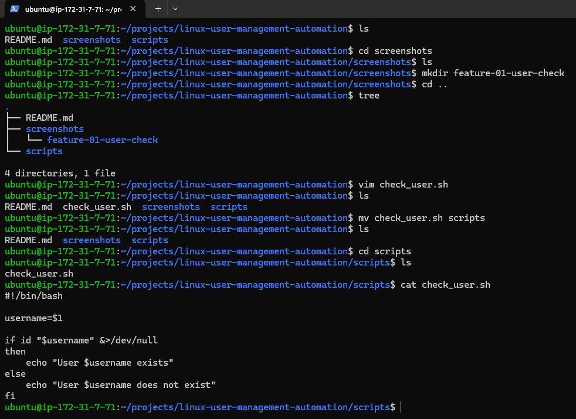
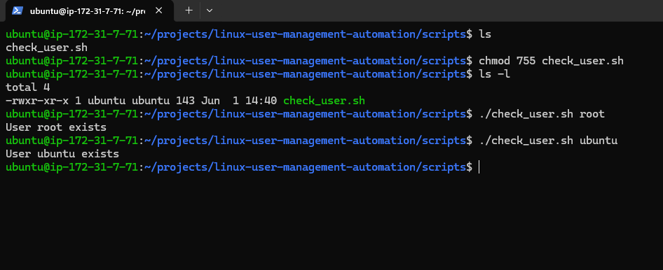
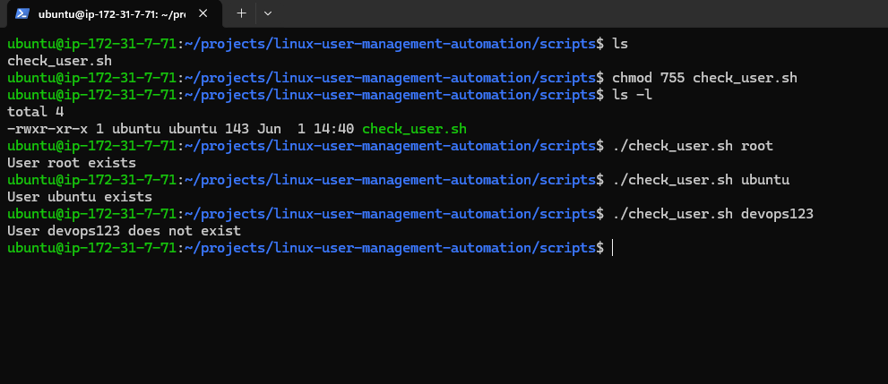
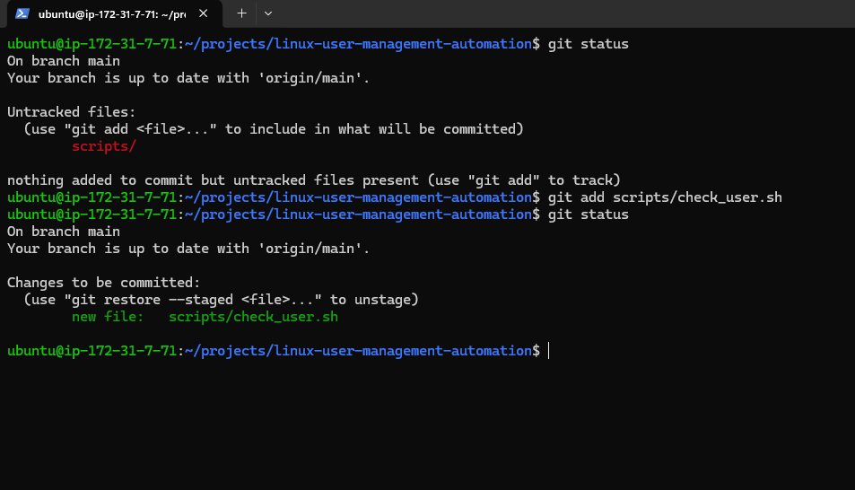
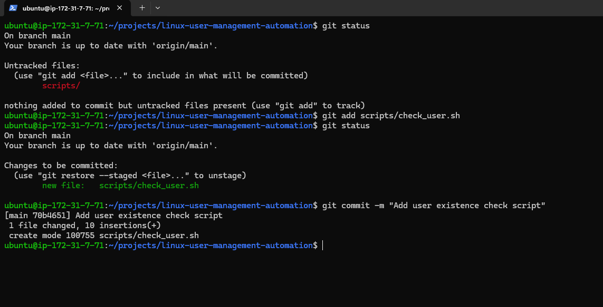
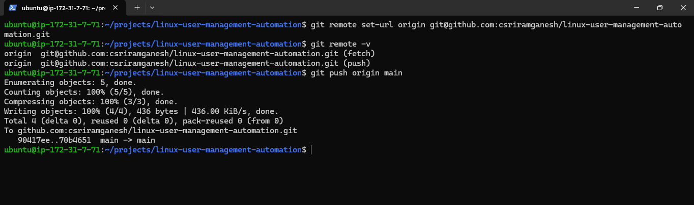
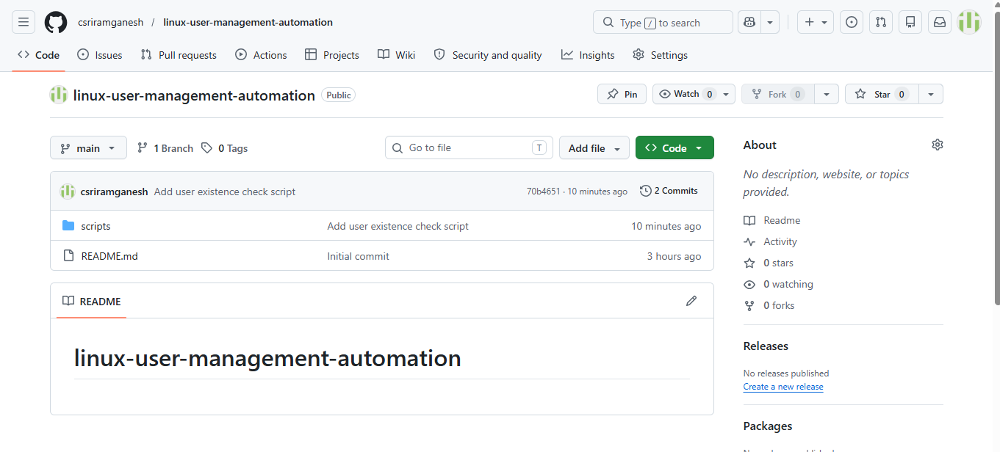

# Linux User Management Automation

A DevOps portfolio project built using Bash scripting to automate Linux user management tasks.

## Feature 1: User Existence Check

This script checks whether a Linux user exists on the system.

### Usage

```bash
./scripts/check_user.sh username
```

Example:

```bash
./scripts/check_user.sh root
```

---

## Script Code



---

## Existing User Test

The script successfully identifies an existing Linux user.



---

## Non-Existing User Test

The script correctly handles a user that does not exist.



---

## Git Workflow

### Staging Files



### First Commit



### Push to GitHub



---

## Repository Published on GitHub



---

## Skills Practiced

* Bash Scripting
* Linux User Management
* Conditional Statements
* Linux Commands (`id`)
* File Permissions
* Git
* GitHub
* DevOps Fundamentals

---

## Repository Structure

```text
linux-user-management-automation
├── README.md
├── scripts
│   └── check_user.sh
└── screenshots
    └── feature-01-user-check
```
